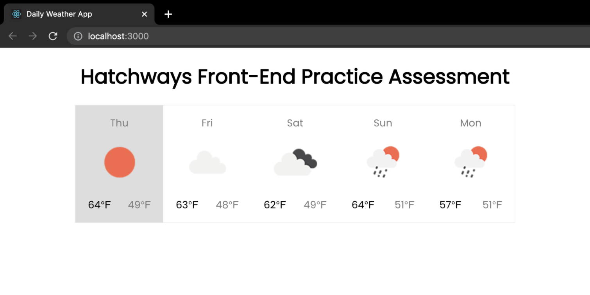

# daily-weather-app

The purpose of this project was to display a 5-day forecast using [openweathermap.org/api](https://openweathermap.org/api) 

You can learn more about this project by visiting [hatchways.notion.site/front-end-practice-assessment](https://hatchways.notion.site/hatchways/Front-End-Practice-Assessment-0a0723b34cae4e41912ff6bf5b7c2b77)

### Screenshot

### Key Technologies

- React.js
- Axios
- HTML
- CSS
- Open Weather Map API

### Installation

1. Fork or clone this repository
2. In your terminal, cd into the project
3. Set up environment variables by running `cp .sample_env .env`
4. Run `npm install` to install project dependencies
5. Run `npm start` to start the project locally at http://localhost:3000

### Resources

- https://hatchways.notion.site/hatchways/Front-End-Practice-Assessment-0a0723b34cae4e41912ff6bf5b7c2b77

- https://openweathermap.org/api
